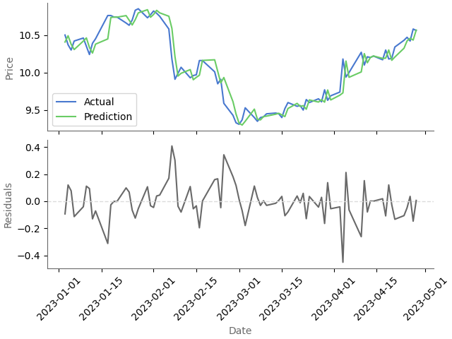

# Time Series Analysis of Nintendo Stock Prices: Uncovering Patterns in Market Volatility

Accurate stock price prediction is difficult due to the numerous variables influencing markets such as economic indicators, geopolitical events, and the ever-fluctuating sentiment of investors. Amidst this complexity, gaming industry stocks stand out as particularly volatile due to rapidly changing consumer preferences, intense competition, and sensitivity to game release schedules. Nevertheless, the robust growth of the digital entertainment sector continues to attract investor interest. Hence, this project aims to develop a time series forecasting model for a prominent video game company.

## **File structure**
<pre>
|- data/
   |- raw/
|- notebooks/
   |- stock_price_forecast.ipynb
   |- figures/
|- time-series-stock-prices/
   |- notes.py
   |- config.py
|- .gitignore
|- LICENSE
|- README.md
</pre>

## Scope
This project aims to develop a time series forecasting model for Nintendo. Nintendo's significance in the gaming industry, iconic franchises, and market impact justify its selection for stock price analysis, offering insights into the broader gaming market.

## Performance metrics
Closing price will be modelled in this data science project. This is a practical and widely accepted approach in data science projects related to stock market analysis as it reflects the market sentiment of a stock's value at the end of the trading day.

## Optimised model

* Mean Absolute Percent Error: **0.95**
* Root Mean Squared Error: **0.13**